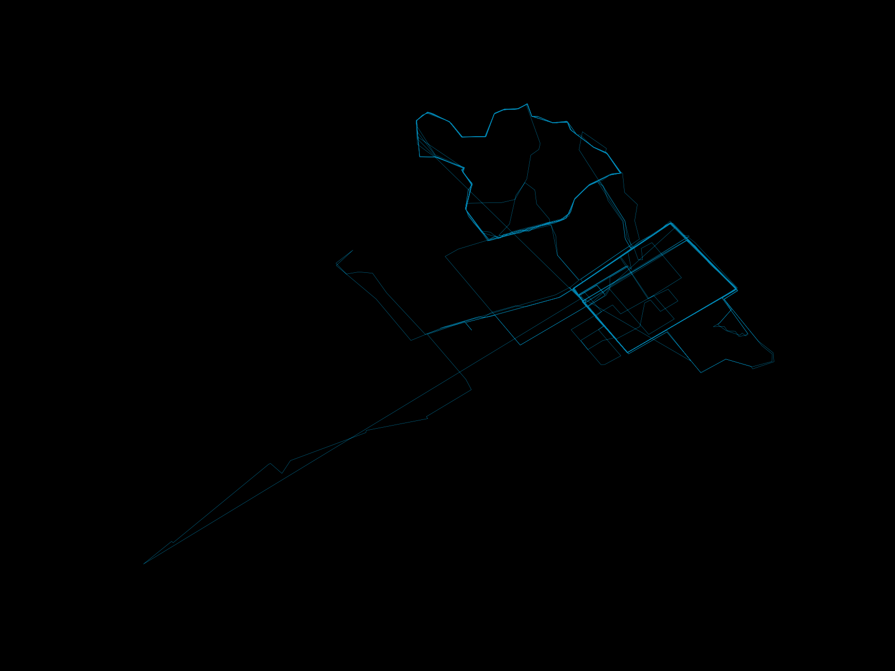

# stravaviz

Create quick and beautiful visualizations of Strava running or cycling data.

Create something like this...



as easy as this.
```
plots.create_heatmap(activities={'after': '2018-06-01', 'before': '2018-09-01'})
```
You can also create [facet plots](https://nbviewer.jupyter.org/github/ashleyshine/stravaviz/blob/master/notebooks/static_plots.ipynb) and [interactive heatmaps](https://nbviewer.jupyter.org/github/ashleyshine/stravaviz/blob/master/notebooks/interactive_heatmaps.ipynb).

## Getting Started

### Installation

Clone this repo:
```
git clone https://github.com/ashleyshine/stravaviz.git
cd stravaviz
```
If you want to use a virtual environment (recommended):
```
# pip install virtualenv
virtualenv stravaviz_env
source stravaviz_env/bin/activate
```

Install required packages:
```
pip install -r requirements.txt
```

### Adding Strava Access Token
In order to access your Strava activity data via Strava's API, you will need to create an app and add your access token to a local config file. See steps 1 & 2 of [this article](https://medium.com/@annthurium/getting-started-with-the-strava-api-a-tutorial-f3909496cd2d) for a walkthrough on obtaining an access token.

Once you have an access token, create a `strava_config.py` file in `./stravaviz`:
```
cd stravaviz
touch strava_config.py
```
Add your access token to the `strava_config.py` file:
```
ACCESS_TOKEN = '<STRAVA_ACCESS_TOKEN_HERE>'
```

## Examples

Creating a map is a simple matter of defining the activities you want to visualize and any additional arguments to customize the style & color of your map. The three types of visualizations available are:

* Static Heatmaps
* Facet Plots
* Interactive Heatmaps

See the [notebooks](https://nbviewer.jupyter.org/github/ashleyshine/stravaviz/tree/master/notebooks/) directory for examples.

From the top-level directory of this project:

### Creating Static Heatmaps

Visualize activities on a standard heatmap.

```
import stravaviz.plots as plots

# Default - plot all activities
plots.create_heatmap()

# Plot activities within a specified range
activities={'after': '2018-01-01', 'before': '2019-01-01'}
plots.create_heatmap(activities)

# Customize map with white background and red lines
plots.create_heatmap(activities, style='white', color='orangered')

# Save map to image file
plots.create_heatmap(activities, save=True)
```

### Creating Facet Plots

Visualize each activity individually in a square grid.

```
import stravaviz.plots as plots

activities = {'after': '2015-01-01', 'before': '2019-01-01'}
plots.create_facet_plot(activities)
```

### Creating Interactive Heatmaps

Visualize activities on an interactive leaflet.js map using [folium](https://python-visualization.github.io/folium/docs-master/).

To create a heatmap, define the center coordinates of the map with `[lat, long]` and pass in any additional parameters:

```
import stravaviz.interactive_heatmap as interactive_heatmap

# Default - plot all activities
interactive_heatmap.create_heatmap(center=[34.063361, -118.440161])

# Customize heatmap with activity and color arguments
interactive_heatmap.create_heatmap(
    center=[34.063361, -118.440161],
    activities={'after': '2018-06-15', 'before': '2018-09-01'},
    style='light',
    color='orangered'
)
```

## License

This project is licensed under the MIT License - see the LICENSE.md file for details

